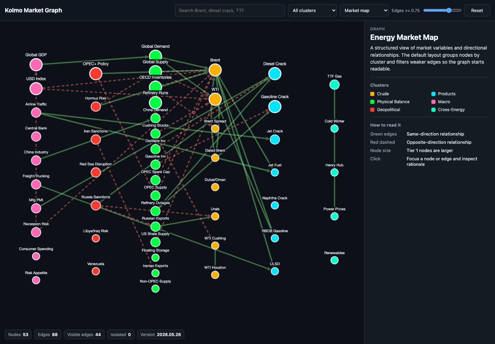

# Kolmo

kolmo_stats is the ultimate intelligence and analysis toolkit for Oil & Gas trading. 

Building the world's largest open-source intelligence graph for energy markets.

[](https://discord.gg/JNCFeKnbC)

---

## What is kolmo?

kolmo provides simple, well-documented repo with tools for energy traders,
analysts, and risk teams. Focused first on crude oil, refined products, natural
gas, LNG, and related derivatives.

This repo aims to bring innovation to the field and the first real AI structure focused on Oil & Gas trading.

It works with data you already have: pandas Series, DataFrames, NumPy arrays, lists,
and dicts. No API keys. No data downloads. No dependencies beyond the standard
scientific Python stack.

---

## Repository layout

kolmo_stats is organised so users can find examples quickly and contributors can
add formulas without learning the whole codebase first.

| Path | Purpose |
|---|---|
| `src/kolmo_stats/` | Python package and public analytics API |
| `tests/` | Formula, validation, and regression tests |
| `examples/` | Runnable examples by topic |
| `docs/` | User conventions, development notes, and architecture guide |
| `knowledge_graph/` | Community-editable oil/gas market relationship graph |

Start with [docs/README.md](docs/README.md) if you are contributing.

---

## Installation

```bash
pip install kolmo-stats
```

Requires Python >= 3.10. Dependencies: numpy, pandas, scipy, networkx, PyYAML.

---

## Explore the market graph

To clone the repo and open the current knowledge graph in your browser:

```bash
git clone https://github.com/GBR24/kolmo_stats.git
cd kolmo_stats
pip install -e .
python examples/08_market_graph_viewer.py
```

The script prints a local URL to open in your browser. By default, that is
usually `http://127.0.0.1:8000`.

If nothing opens, paste the printed URL into your browser. If port `8000` is
already busy, choose another port, for example:

```bash
python examples/08_market_graph_viewer.py --port 8001
```

The viewer uses Cytoscape.js in the browser for structured graph layouts. It
shows current nodes, relationships, clusters, search, node details, edge
rationale, and graph health. It is the easiest way to inspect the graph before
opening a no-code issue or editing `src/kolmo_stats/graph/market_graph.yml`.



---

## Quickstart

```python
import numpy as np
from kolmo_stats import (
    crack_spread, curve_shape, curve_slope,
    historical_var, npv, breakeven_price, lng_arbitrage,
)

# Brent forward curve
brent = {"M1": 84.5, "M2": 83.2, "M3": 82.1, "M6": 80.5, "M12": 78.0}
print(curve_shape(brent))        # 'backwardation'
print(curve_slope(brent))        # -1.68  (negative = backwardation)

# Refinery margin
crack = crack_spread(crude=80, gasoline=103, distillate=110, ratio="3-2-1")
print(f"3-2-1 crack: ${crack:.2f}/bbl")

# LNG arbitrage
arb = lng_arbitrage(14.0, 3.5, freight_cost=2.0, liquefaction_cost=2.5,
                    regas_cost=0.3, boil_off_cost=0.2)
print(f"LNG arb: ${arb:.2f}/MMBtu")    # positive = arb is open

# Historical VaR: output is in the same units as the input returns/P&L
returns = np.random.randn(500) * 2
print(f"VaR 95%: ${historical_var(returns):,.0f}")

# Project NPV
cashflows = [80, 120, 140, 130, 110, 90, 70, 50, 30]
print(f"NPV: ${npv(cashflows, discount_rate=0.12, initial_investment=400):.1f}M")


```

---

## Function catalog

kolmo-stats includes public helpers for statistics, curves, spreads, risk,
project economics, units, and the market graph. The complete list now lives in
[docs/FUNCTION_CATALOG.md](docs/FUNCTION_CATALOG.md) so the README can stay
readable as contributors add more formulas.

---

## explain=True

Most analytical functions accept `explain=True` and return a dict with the result,
a plain-English explanation, the formula, and the key inputs.

```python
from kolmo_stats import crack_spread
print(crack_spread(80, 103, 110, ratio="3-2-1", explain=True))
# {
#   'result': 25.33,
#   'explanation': 'Gross refinery crack spread proxy using the 3-2-1 ratio.',
#   'formula': '((2 * gasoline) + distillate - (3 * crude)) / 3',
#   'inputs': {'crude': 80.0, 'gasoline': 103.0, 'distillate': 110.0, 'ratio': '3-2-1'}
# }
```

---

## Contributing

See [CONTRIBUTING.md](CONTRIBUTING.md) and [docs/DEVELOPMENT.md](docs/DEVELOPMENT.md).
Four levels: market knowledge, formulas, analytical models, and numerical engine
improvements.

## License

MIT
